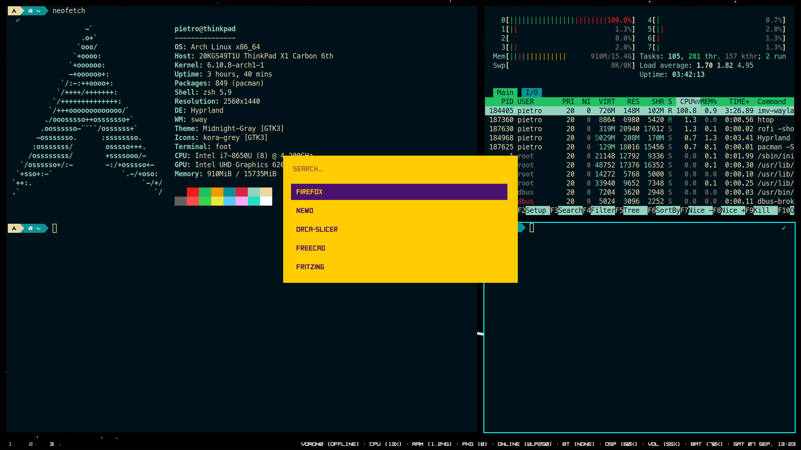

# My dot files

## Aur packages

* fritzing
* gimp-git
* libart-lgpl (exploited by gimp)
* nemo-compare
* orca-slicer-bin
* polyclipping (exploited by fritzing)
* rofi-lbonn-wayland
* swaylock-effects-git
* ttf-harmonyos-sans (exploited by orca slicer)
* ttf-meslo-nerd-font-powerlevel10k

## Firefox theme

* [dark space](https://addons.mozilla.org/en-US/firefox/addon/nicothin-space/)
